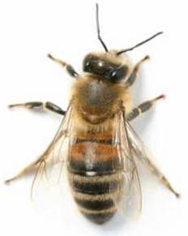
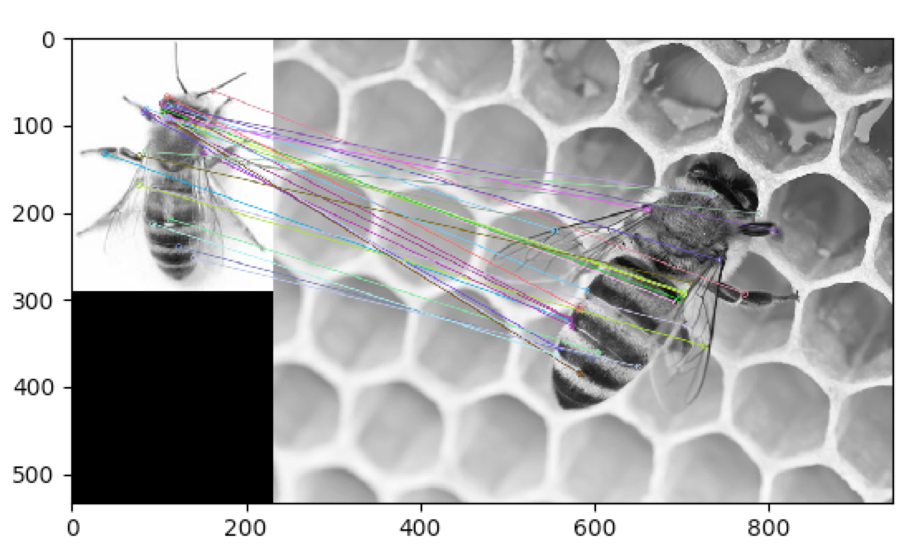
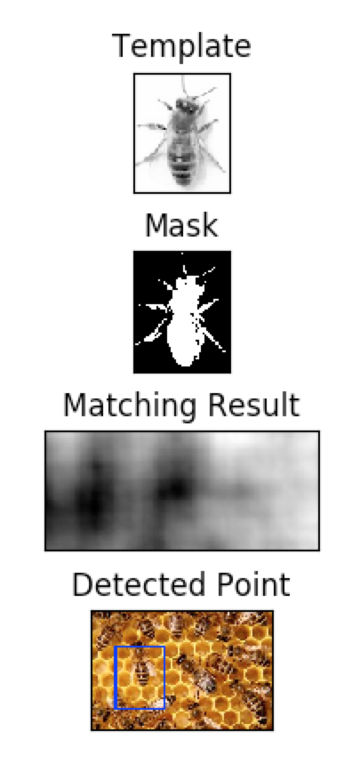
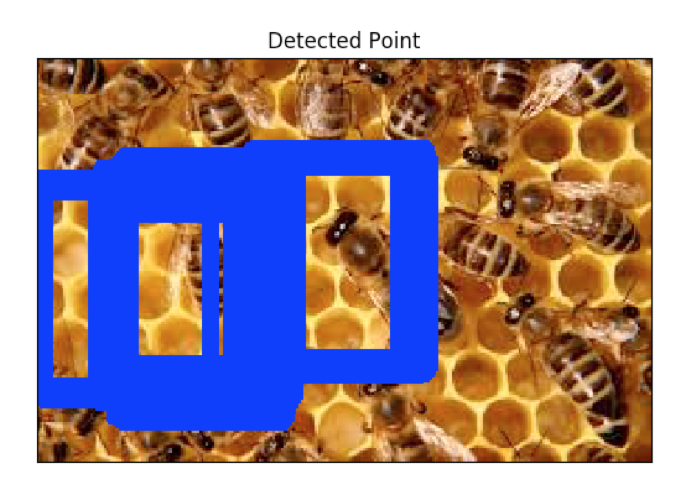
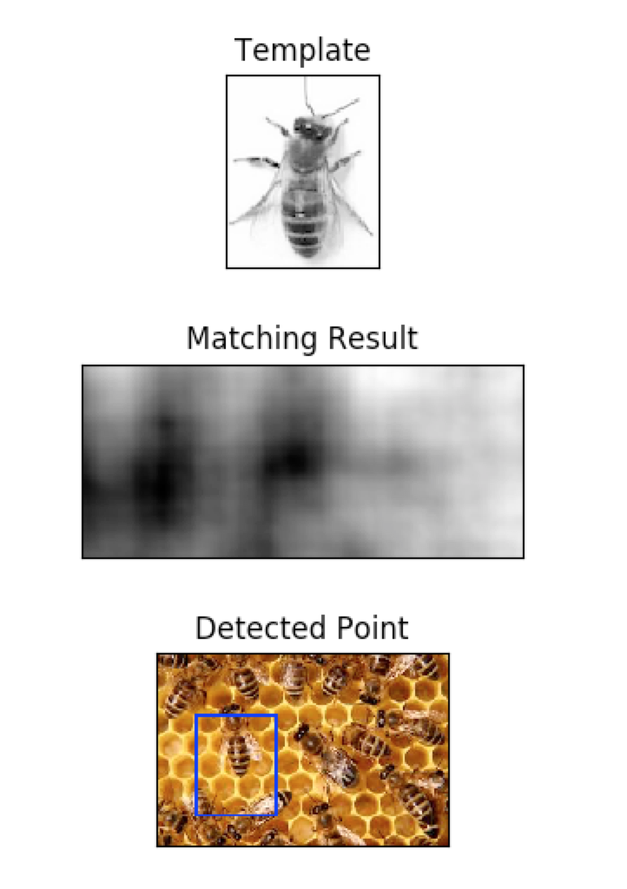

## Playing with Computer Vision:
or: an exploration of bees

This project uses OpenCV, a C++ computer vision library with bindings in a number of languages. I chose to use opencv-python, which [can be installed using `pip`](https://pypi.python.org/pypi/opencv-python) but tbh is kind of a process.

My end goal is to use image recognition to count the number of bees in flight. Here I've used top-down images of bees on comb to simplify the problem while I'm learning the tools.

## Results So Far
I used two different methods to find matches: `keypoint detection` and `template matching`.
I used the same source image for both methods:

### Keypoint Matching
`Keypoint matching` uses corner detection to find points that are likely to be significant, then attempts to match those points to features in other images. I used an [`ORB` matcher](https://pdfs.semanticscholar.org/ba15/402db9c561499018354b0139729d005bfa4a.pdf) to detect and describe features. One perk of ORB is that it handles rotation. Here's the resulting matching between my source image and a on comb:

Note that it's... not great. Similar features on both bees are confused with other features, and this will need significant tweaking before it reliably identifies a `bee` in an image.

### Template Matching
Since bees are generally alike, I thought template matching might be a better approach.

My source image included a lot of whitespace, so I generated a mask using `bitwise_not` to flip the white and black space, then threshold contouring to grab the bee-yist parts of the image.

Using this mask, I was able to generate a match image (black areas have a high match for the template), and display the *best* match:

But in this case, I want to see multiple matches, so I can count the bees.
Displaying the top 100 or so matches shows that there's a lot of overlap between the potential matches:

To dedupe these multiple similar matches, I implemented `Non-Maxima Supression`, which checks surrounding pixels for a better match and only keeps the best local match.

That helped with the duplication issue:

### Conclusion
> Template matching yielded better initial results but doesn't account well for rotation and varying scale, so keypoint detection is a better choice.

Even with deduping, template matching was only able to detect the bee in roughly the same position as our template bee. That's an accepted limitation of template matching; it doesn't handle scaling or rotation. Some people solve this by rotating the template 360 degrees in a loop, and gathering matches for each rotation. That seems hacky to me- when I revist this project I'll focus on improving the keypoint matching to get better matches for. asingle bee in various environments, and then work on being able to match multiple bees.

