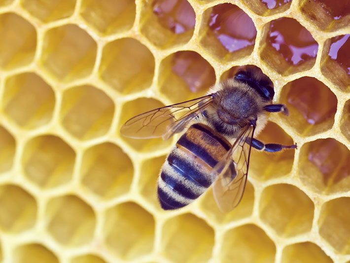

## Playing with Computer Vision:
or: an exploration of bees

This project uses OpenCV, a C++ computer vision library with bindings in a number of languages. I chose to use opencv-python, which [can be install using `pip`](https://pypi.python.org/pypi/opencv-python) but tbh is kind of a process.

## Results So Far

### Is it a bee?

### Maybee?!

